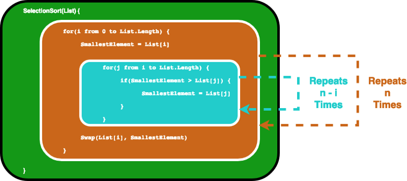

## 1. How can the random module be utilized in Python to generate random numbers or make selections from a list, and what are some common functions available within the module?

    The random module provides access to functions that support many operations. Perhaps the most important thing is that it allows you to generate random numbers.

    The Random module contains some very useful functions namely randint() function, random() function, choice() function, randrange() function and shuffle() function. 

## 2. In the context of software development, what is risk analysis, and what are the key steps involved in conducting a risk analysis for a software project?

__risk analysis__ : 
- is the process of identifying the risks in applications or software that you built and prioritizing them to test. 
- After that, the process of assigning the level of risk is done. The categorization of the risks takes place, hence, the impact of the risk is calculated.

__There are three steps to perform Risk Analysis:__

- Searching the risk

- Analyzing the impact of each individual risk

- Measures for the risk identified

## 3.What is test coverage and why is it an important (or potentially misleading) metric in software testing?

    Test coverage is a useful tool for finding untested parts of a codebase. Test coverage is of little use as a numeric statement of how good your tests are.

    the value of coverage analysis it helps you find which bits of your code aren't being tested.  It's worth running coverage tools every so often and looking at these bits of untested code. 

## 4.What is Big O notation, and how is it used to describe the performance of an algorithm? Give an example of an everyday task (not software related) that demonstrates O(n) time complexity.

 __Big O notation__ is a mathematical notation that describes the limiting behavior of a function when the argument tends towards a particular value or infinity.  

    Big O notation describes the complexity of your code using algebraic terms.

### we can take a look at a typical example, O(n²), which is usually pronounced “Big O squared”. The letter “n” here represents the input size, and the function “g(n) = n²” inside the “O()” gives us an idea of how complex the algorithm is with respect to the input size.

example :  
<code>
SelectionSort(List) {
  for(i from 0 to List.Length) {
    SmallestElement = List[i]
    for(j from i to List.Length) {
      if(SmallestElement > List[j]) {
        SmallestElement = List[j]
      }
    }
    Swap(List[i], SmallestElement)
  }
}
</code>
 
 

### BIG(O) ==> n²/2-n/2.

