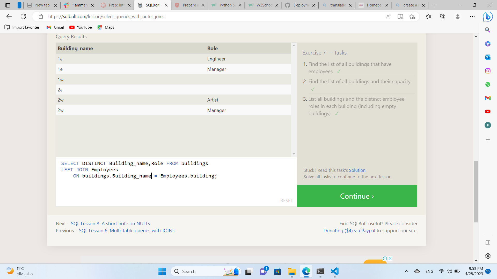

# Introduction to SQL

SQL, or Structured Query Language, is a language designed to allow both technical and non-technical users query, manipulate, and transform data from a relational database. And due to its simplicity, SQL databases provide safe and scalable storage for millions of websites and mobile applications.
 
 
 
 

 A relational database represents a collection of related (two-dimensional) tables. Each of the tables are similar to an Excel spreadsheet, with a fixed number of named columns (the attributes or properties of the table) and any number of rows of data.

 
  
 
  
 
 
 
 
 
 
 
 
 
 
 
 
 